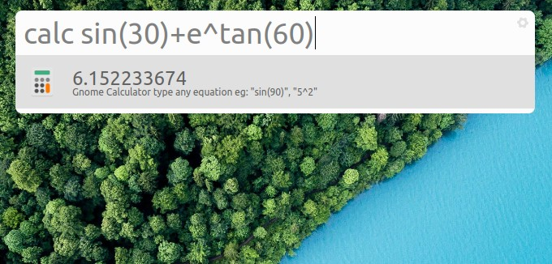

# albert-gnome-calculator
An extension for [albert lanucher](https://albertlauncher.github.io/) in Linux to calculate equations using gnome calculator. Gnome calculator must be installed.



## Installation Guide
Clone this repository to `~/.local/share/albert/org.albert.extension.python/modules`
```
git clone https://github.com/piverine/albert-gnome-calculator.git $HOME/.local/share/albert/org.albert.extension.python/modules/GnomeCalculator
```
Enable `gnome-calculator` plugin in `albert settings - Extensions - Python`


