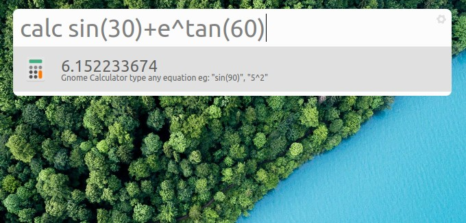

# Albert-Gnome-Calculator

**Albert-Gnome-Calculator** is an extension for the [Albert launcher](https://albertlauncher.github.io/) in Linux that enables users to perform advanced mathematical calculations directly within Albert using the GNOME Calculator as the backend. This extension is especially useful for those who need quick calculations without switching applications.

## Features
- Supports advanced mathematical expressions.
- Seamlessly integrates with GNOME Calculator.
- Quick and efficient for everyday calculations.

## Prerequisites

To use this extension, ensure the following are installed:

1. [Albert Launcher](https://albertlauncher.github.io/).
2. GNOME Calculator (can be installed via your Linux package manager).

## Installation

1. Clone this repository to the appropriate directory for Albert Python extensions:

   ```bash
   git clone https://github.com/piverine/albert-gnome-calculator ~/.local/share/albert/org.albert.extension.python/modules
   ```

2. Open Albert settings, navigate to **Extensions** > **Python**, and enable the `gnome-calculator` plugin.

## Usage

1. Launch Albert.
2. Type `calc` followed by your mathematical expression. For example:
   ```
   calc sin(30) + e^tan(60)
   ```
3. Press Enter, and the result will be displayed using GNOME Calculator.

### Examples
- **Basic Arithmetic**: `calc 5 + 3 * 2`
- **Trigonometric Functions**: `calc sin(45) + cos(30)`
- **Exponential and Logarithmic Functions**: `calc e^2 + log(10)`

## Troubleshooting

### The extension does not appear in Albert:
- Ensure the repository is cloned to the correct directory: `~/.local/share/albert/org.albert.extension.python/modules`.
- Verify that Python extensions are enabled in Albert settings.

### GNOME Calculator is not responding:
- Confirm GNOME Calculator is installed and functional.
- Test by running `gnome-calculator` in the terminal.

## Contributing
Contributions are welcome! If you have ideas for new features or find any issues, feel free to create an issue or submit a pull request on the [GitHub repository](https://github.com/piverine/albert-gnome-calculator).

## License
This project is licensed under the MIT License. See the [LICENSE](https://github.com/piverine/albert-gnome-calculator/blob/main/LICENSE) file for details.

## Acknowledgments
- [Albert Launcher](https://albertlauncher.github.io/)
- GNOME Calculator


